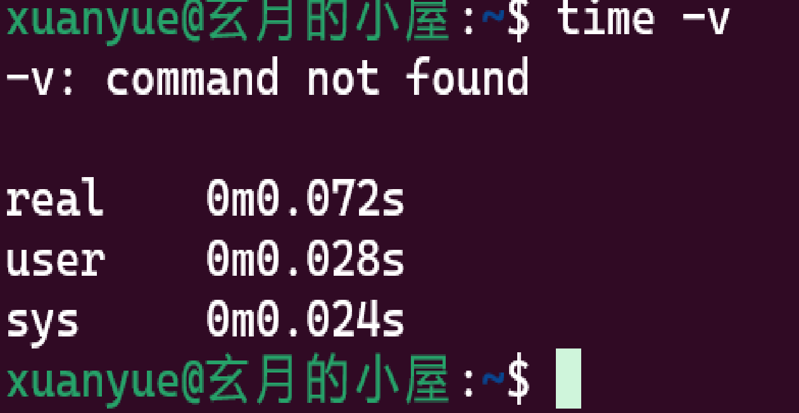

# 2024秋炒蒜考核报告

## 1. 虚拟机环境搭建
VMware？  WSL!
---
在配置我的环境中遇到了不少问题。
使用五天前VMware搭建好的ubuntu时，突然发现无论如何打开，最终都会死机，这让我十分沮丧。正所谓重装解千愁，我打算重下时，ubuntu在最后几m硬是下载不下来，连试几次都无济于事。最终下好了也是在重装上毫无用处，因为始终是死机。这在我完成任务中消耗了不少的时间_(大概两三天在折腾吧)_

在绝望之中，我看到群友在使用wsl虚拟机。因此，我决定尝试使用，并轻松地完成了安装。
[安装教程](https://blog.csdn.net/qq_43636384/article/details/128453416?ops_request_misc=%257B%2522request%255Fid%2522%253A%252288086F08-BBFA-422C-9D02-D1C680B4B35A%2522%252C%2522scm%2522%253A%252220140713.130102334..%2522%257D&request_id=88086F08-BBFA-422C-9D02-D1C680B4B35A&biz_id=0&utm_medium=distribute.pc_search_result.none-task-blog-2~all~top_positive~default-1-128453416-null-null.142^v100^pc_search_result_base2&utm_term=wsl2%E5%AE%89%E8%A3%85&spm=1018.2226.3001.4187)

## 2. gcc安装

在gcc的安装过程中，我并没有遇见多少问题，只是有些卡顿，在切换了默认下载源后，顺畅了不少。

换源教程同上。

## 3. 排序算法实现
为了独立完成代码，我尝试先只了解其核心逻辑，再根据自己的理解写出代码的方式来完成代码。但碍于多年没有摸过代码，我面对报错时，会向ai询问错误原因。
当然...它帮我改过不少代码，对我的代码进行了优化，删除了不少不必要的成分。

- **冒泡排序**：不得不说，是全场最简单的代码。对于这个，我只需要将它的基本概念顺着写一写就可以了。我创造了compare()进行比较，exchange进行交换，然后用两个for反复比较。最终的复杂度自然是_O(n^2)_。
- **基础堆排序**：
在这里，我选择了最大堆排序。而我使用的是多次循环，遍历每一级元素，然后再检查是否还有交换存在，如果有，就再检查一遍。涉及的小循环操作次数为n/2，最差的运气的话要大循环要运行logn次，所以复杂度为_O(nlogn)_。

- **斐波那契堆排序**：
说实话，面对这一段代码毫无头绪，虽然学完了结构体和链表，面对复杂的子节点添加与删除一点办法也没有。最终，在倔强与无奈中，我向ai妥协，却发现它有字数限制。。。在了解了left，right的巧妙构造后，早已为时已晚。*（我一直想的是使用父节点与子节点直连）*

## 4. 测试数据生成

在数据生成中，由于没有任何关于脚本的知识，我选择了使用c语言里的rand（）来生成我们的测试数据，使用%m+n来框定数据条数范围，并使用fprintf来重定向数据到名为test的来记录原始数据，和Ttest来记录编排后的数据。（浮点数只要除以10^n即可实现）
1.冒泡排序的数据确认

在确认方面，我直接大致确认了一遍数据是否是按照从大到小的顺序排的。
在完成几个样本后，我投向ai确认了一遍，以确保它的正确性。
2.基本堆排序的确认

在基本堆排序的代码编写中，我尝试了各式各样的小数组来确定它的正确性。因此，我只需要测试较大的数据即可，与上面一样，我丢给ai测试了。
3.基本斐波那契堆排序确认
因为我无法确认，直接让ai编写完代码，将结果丢给ai自己省察。
为了确认不同的堆，我使用了两个换行来分割。

## 5. 性能测试

对于时间，我使用了c语言中<time.h>的clock来计算时间长度，并重定向其到结果文件里。关于cpu，内存占用方面，我尝试使用time -v来记录，但毫无用处，网上查找也没有任何头绪。

在收集时间中，我没有考虑到多次运行的输出会替换先前的文件，导致无法高效地收集数据。（如果使用脚本，或许会好不少T_T）

## 6. 数据可视化

既然在收集数据方面处处碰壁，自然绘画表格是无稽之谈了QAQ。

## 致谢

- ncuscc中乐于助人的群友：老鸽、彩彩、浩绪等人的帮助；
- chatglm、kimi ai的耐心指导；
- b站、CSDN、知乎上各大佬的教学帖子；
- ncuscc里的提示。

---

**报告撰写人**：张龙浩 
**提交日期**：2024年10月24日  
**GitHub仓库地址**：目前还未上传。。。